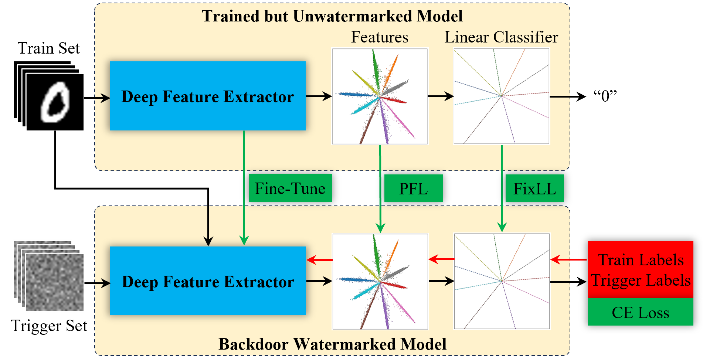

# Deep Classification Model Backdoor Watermarking

## About
Implementation of backdoor watermarking methods for deep classification models, featuring

1. Unambiguous backdoor trigger sets with high-fidelity embedding [1];
2. Realization of **deep fidelity** for backdoor watermarking deep classification models [2].

## Pretrained Models
The repo contains pretrained ResNet18 for MNIST for demonstration. Note that the visualization of training data feature distribution and prototype vectors (corresponding to decision boundaries) is only for ResNet18 with the penultimate layer changed to 2 neurons. All the pretrained models (ref models) can be downloaded from [here](https://drive.google.com/file/d/13qE1t5d7dsyB_RVHIBDERnyFZOs1SoH9/view?usp=drive_link).

## Note: Modify Model Forward Path Before Running
1. Set the last layer (a linear layer) bias to "False";
2. Rename the last layer to "out";
3. Modify model output to the tuple (feature, output).

## Deep Fidelity
We propose that in general, watermarks for deep learning models should preserve deep fidelity, not only the fidelity measured by extrinsic metrics (e.g., learning accuracy), but also the intrinsic mechanism of the model to be protected.

Realizing this concept for deep classification models, it is stated that deep fidelity is not only concerned with good learning accuracies (train and val accuracies), but also concerned with the preservation of the intrinsic mechanism of the model, i.e., feature learning and classification. Therefore, to achieve deep fidelity, one should preserve both the training data feature distribution and the decision boundary of the unwatermarked model. The figure below illustrate how deep fidelity is achieved:

<left></left>

## Citation Information
 > \[1] G. Hua, A. B. J. Teoh, Y. Xiang, and H. Jiang, "Unambiguous and high-fidelity backdoor watermarking for deep neural networks," IEEE Transactions on Neural Networks and Learning Systems, 2023. [link](https://ieeexplore.ieee.org/document/10059007)

> \[2] G. Hua and A. B. J. Teoh, "Deep Fidelity in DNN Watermarking: A Study of Backdoor Watermarking for Classification Models," Pattern Recognition, 2023. [link](https://ieeexplore.ieee.org/document/10059007)

